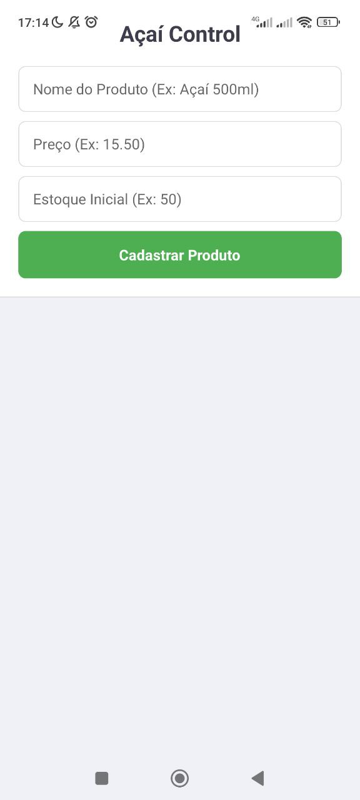
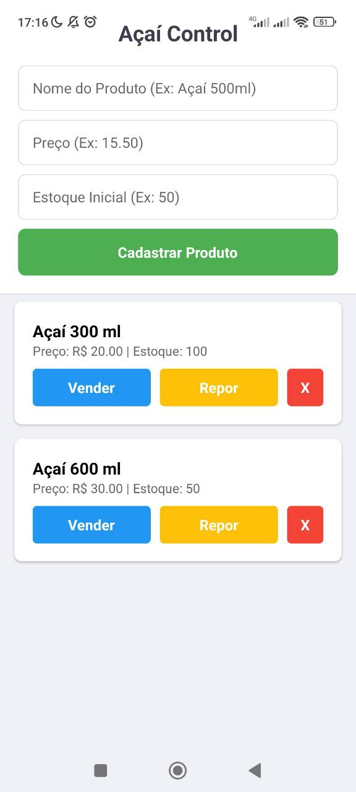

#  Açaí Control 🍧

## 🎯 Propósito do Aplicativo

O **Açaí Control** é um aplicativo mobile simples, desenvolvido em React Native, para auxiliar pequenos negócios locais, como a "Açaí do Bairro", na gestão de suas operações diárias. O objetivo é substituir o controle manual de vendas e estoque por uma solução digital, offline e fácil de usar, reduzindo erros e otimizando a gestão de insumos.

## 📸 Telas do App

Abaixo estão as telas principais do aplicativo em funcionamento.

| | |
|:---:|:---:|
|  |  |


## 🚀 Como Executar o Projeto

Para executar este projeto, você precisará ter o [Node.js](https://nodejs.org/) e o app [Expo Go](https://expo.dev/client) instalados.

```bash
# 1. Clone o repositório
git clone [https://github.com/pereswes-stack/acai-control.git](https://github.com/SEU-USUARIO/acai-control.git)

# 2. Navegue até a pasta do projeto
cd acai-control

# 3. Instale as dependências
npm install

# 4. Instale o AsyncStorage (dependência específica do Expo)
npx expo install @react-native-async-storage/async-storage

# 5. Inicie o servidor de desenvolvimento
npm start

# 6. Escaneie o QR Code com o app Expo Go
